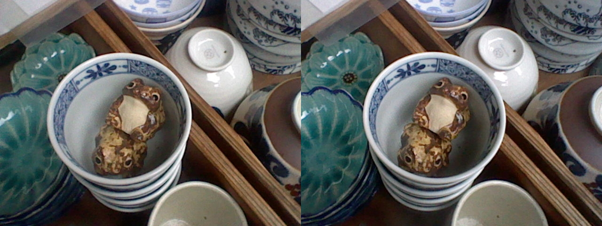
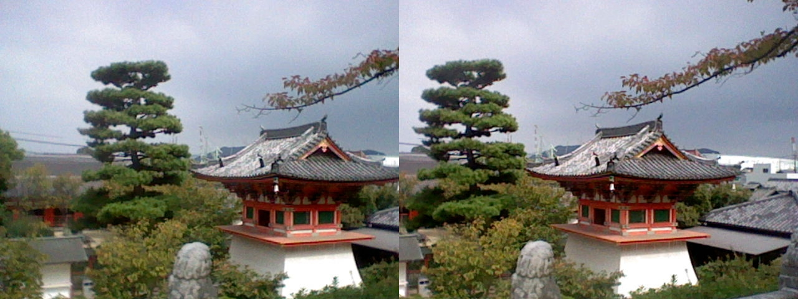

# MPO-to-SBS3D
A script for converting (sub)directories with stereo 3D .MPO files to side-by-side .JPGs suited for cross-eye 3d viewing.
Made with the Nintendo 3DS in mind but probably also works sources. If

This script keeps maintains the original file structure in the result directory and transfers the exif data from the original files. 
This is an example if run from the N3DS DCIM folder:
```bash
└── SD
    ├── MPO-SBS3D.py
    └── DCIM
       ├── 101NIN03
       │   ├── HNI_0001.MPO
       │   ├── HNI_0001.JPG (not side-by-side)
       │   ├── HNI_0002.MPO
       │   ├── HNI_0002.JPG (not side-by-side)
       │   └── ...
       └── 102NIN03
           ├── HNI_0001.MPO
           ├── HNI_0001.JPG (not side-by-side)
           └── ...
```
which would become
```bash
└── SD
    ├── MPO-SBS3D.py
    ├── DCIM
    │    └── ...
    └── DCIM-SBS
       ├── 101NIN03
       │   ├── HNI_0001.JPG (side-by-side 3d)
       │   ├── HNI_0002.JPG (side-by-side 3d)
       │   └── ...
       └── 102NIN03
           ├── HNI_0001.JPG (side-by-side 3d)
           └── ...
```

Valid command line arguments are:
```bash
-s <source_dir>          default: ./DCIM
-d <destination_dir>     default: ./DCIM-SBS
```


A few examples of the resulting files. Cross your eyes and try to make the two sides overlap.



